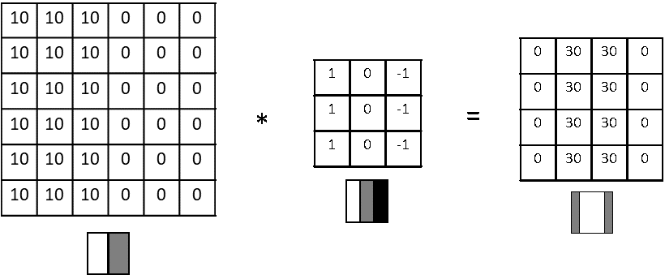

# Edge Detection
영상 인식의 시작은 테두리를 인식하는 것부터!

인식은 수직선 감지와 수평선 감지로 나뉨.
하지만 매커니즘은 비슷함.

어떻게 인식하냐고??

위의 이미지와 같이 본다면 10과 0이 바뀌는 이 구간이 edge겠지??  
이것을 감지하기 위해 filter라는 것을 사용함.  
filter는 위 이미지의 가운데 있는 작은 매트릭스.  
이것을 1 0 -1로 나누어서 저렇게 배치하는데, 저기에 들어가게 된다면 수평으로 갈릴 것 같지 않아??  

그리고 이 filter를 1,1부터 한땀 한땀 움직이는 것이지.  
1,1위치를 예시로 들면  
10 10 10  
10 10 10  
10 10 10  
이란 행렬을 filter와 하나하나 곱한 값이 결과의 1,1이 되는 것이지.

결국 다 연산하면 이미지의 오른쪽 행렬같이 정리되는것이고.

왼쪽행렬의 차원은 filter가 한칸씩 움직이니까 간단히 계산할 수 있지??

원본행렬이 NxN이고 filter행렬이 FxF라면
결과행렬은 N-F+1xN-F+1.  

그러니까 이미지의 결과 행렬은 6-3+1 = 4 인것이지.